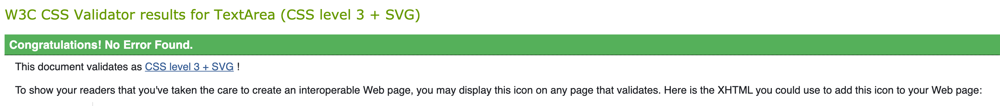
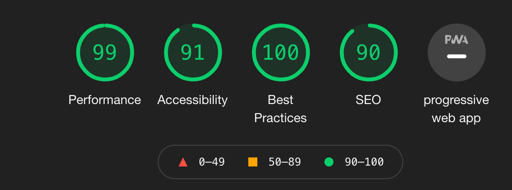
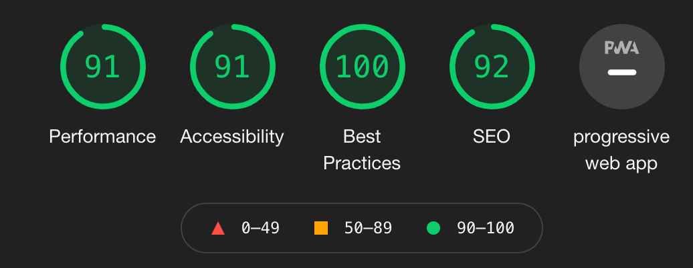

# WordIt Memory Game

Word-It is an interactive memory game inspired by the classic game [Bopit.](https://en.wikipedia.org/wiki/Bop_It)  
The user will have to select the word given as quickly as possible before the timer runs out, 
the further you get on in the games the time you have to select the correct word decreases.

## UX

Word-It is based around one of my favourite childhood games Bopit, there was something so satisfying about acting out the commands given
by the game as quick as you can whilst the pace of the game got quicker and quicker the higher up your score went.

That's what I went for with Word-It but with an added Twist, instead of following the Bopit commands, twist it, bop it, pull it and flick it  
I went for Red, Green, Blue and Yellow but the catch is the background colour doesn’t match with the word.

The game was designed for the user who wants to experience a version with the fundamentals of Bopit with the added extras which makes it more 
practical and effective whilst being played on Desktop, Tablet & Mobile.

### User’s goal

* Understand the game and have fun playing it.
* Feel challenged to beat their high score.
* Easy to read the game.
* Visually pleasing.
* Large clickable buttons.

### Development goals

* Minimal Design.
* Breaking down each section so all functions work correctly.
* Making sure all controls are clear.
* Works well on all devices.

### User's Stories

**As a user playing the game I want:** 

* To be able to understand the game and controls easily.
* Large clickable buttons on all displays.
* The ability to see and try to beat my high score.
* See how long I have before I'm out of time.
* Know what score I just earned.

**As a Developer Developing this game I want:**

* To ensure the design is minimal with the least amount of distraction from the main focus within the game.
* Display a popup when the game first loads explaining how to play.
* Make sure the game is playable on all devices.
* Make the user's awareness of keyboard controls whilst playing on the desktop.
* To display how much time the user to select the correct command.

### Wireframes

* [WordIt - Desktop](assets/images/wireframes/wordit-desktop.png)
* [WordIt - Desktop](assets/images/wireframes/wordit-tablet.png)
* [WordIt - Desktop](assets/images/wireframes/wordit-mobile.png)

### Design Choices

**Fonts**

* The font im using through is called [Heebo,](https://fonts.google.com/specimen/Heebo?preview.text_type=custom) 
within this font I will being using two styles through out the game, 800 & 200

**Colours**

For the background I went for an of shade of black as it allows user to easily focus on one thing at a time compared to a light background.

Colour used: #181818

Titles: #ffffff

Paragprahs & outlines: #B2B2B2

The buttons are made of four vibrant colour choices which are:
* Red - #FC0050
* Blue - #28CDFF
* Green - #00E384
* Yellow - #FFBA19

They are all chosen as with a purpose to be the main focus within the game.

You can view the final mockup design below:

[WordIt Mockup](assets/images/wireframes/wordit-mockup.jpg)

### How to Play

Once you click start and you will have to click the button that corresponds with the WORD displayed in the centre of the screen, 
you are following the word and not the background colour of the button, You will have 35 seconds to get as many as you can correct.

The player may also use the key commands displayed on the screen.

## Features

### Existing Features

* Feature 1 - 4 main buttons which will all be clickable whether or not it's the correct answer.
* Feature 2 - A start button to begin the game.
* Feature 3 - Your score will be displayed each time you play the game.
* Feature 4 - Your high score will be displayed for as long as your playing the game, but once you refresh the page it will reset.
* Feature 5 - Key commands will be useable on desktop. 
* Feature 6 - A timer will show you how long you have to click the correct command once it has been given.

### Features Left to Implement

* I would like your high score to permanently save with a leaderboard so users can compete to be at the top.

* I would like to add sound to the game if I had more time.

## Technologies Used

* [HTML](https://en.wikipedia.org/wiki/HTML)
    * For Structuring the site.

* [CSS](https://en.wikipedia.org/wiki/CSS)
    * For Styling the Site.

* [JS](https://en.wikipedia.org/wiki/JavaScript)
    * For programming the game.

* [Bootstrap](https://getbootstrap.com/)
    * For Grid Layout & Components.

* [Google Font](https://fonts.google.com/)
    * For selected font.

* [JQuery](https://jquery.com/)
    * Used for certain sections within the script.js file

* [Github](https://github.com/)
    * Storing project on.

* [Balsamiq](https://balsamiq.com/wireframes/?gclid=Cj0KCQiA3smABhCjARIsAKtrg6JfbE3I-05NWUBL17jlkE6uDkROXDoD5vXo7UJxVKIjsLVwujyaus0aAhAiEALw_wcB)
    * Creating wireframes on.

* [Google Chrome Developer Tool](https://developers.google.com/web/tools/chrome-devtools)
    * Checking my game is responsive on multiple different devices.

* [Affinity Designer](https://affinity.serif.com/en-gb/designer/)
    * Creating Word It! Logo.

## Testing

* Devices tested on:
    * Macbook Pro 13"
    * Lg 27" Monitor
    * iPhone 11
    * All devices in inspector tool.

* Browsers Tested on:
    * Google Chrome
    * Safari
    * Firefox

### User's Stories

* Instructions are displayed on load explaining how to play the game.
* All text and buttons are large and clear to read.
* Both high score and game score are always visible on all devices.
* The timer is always showing during the game.
* The design with very clean and minimal with very few distractions from the main game.
* Keyboard commands are displayed at the bottom of the game on desktop view so users are aware they can be used.

### Manual Testing

1. Start button
    * When clicked it's hidden, making room for random commands and a timer.
    * A hover effect is shown to ensure users its clickable.
    * When the game is over via an incorrect click or out of time the start button reappears.

2. Random commands
    * During the game, one of the four commands from the array will be displayed in the centre of the screen at random.
    * When correct, a text-shadow will flash green letting users know they are onto the next random command.
    * Commands are removed if the game has ended.

3. Timer
    * The timer is displayed as soon as the game begins.
    * once it reaches 0 the game will end.
    * Incorrect answers will remove the timer as well.

4. Buttons
    * Each button matches with the command it corresponds with.
    * Buttons are disabled when the game has ended.
    * Buttons are enabled during the game.
    * All buttons have a hover effect.
    * When the button that doesn't match the command is clicked the game will end.

5. Score
    * The score will increase by one every time the correct button is clicked.
    * When the game has ended the score will remain displayed until the game starts again where it will reset to 0.

6. High score
    * The high score will remain in place until the page reloads.
    * Your best score will always replace your current high score.

7. Key commands
    * Pressing W key will click the red button during the game.
    * Pressing A key will click the yellow button during the game.
    * Pressing S key will click the green button during the game.
    * Pressing D key will click the blue button during the game.
    * Space Bar will also start the game.

8. On-Page Load
    * A modal is displayed explaining how to play the game.
    * All previous current high scores are reset.

### Testing Code

* W3C Markup Validator Results
    * Word It Game - [Results](https://validator.w3.org/nu/?doc=https%3A%2F%2Fhellyryan1995.github.io%2FWordit-Game-MS2%2F)

* W3C CSS Validator



* Sites Performace

**Desktop**


**Mobile**


### Bugs Discovered

* Problem 1 - Using this code was causing the gameloop to get stuck within endgame.
```
    $("#red-button").click(function() {
        if (command === 'Red') {
            document.getElementById("command").style.textShadow = "10px 10px 30px #00E384";
            setTimeout(function(){
             document.getElementById("command").style.textShadow = "none";  
            }, 100);
            updateScore();
            playGame();
        } else {
            endGame();
            $('#myModalOver').modal('show');
        }   
    });
``` 
* Problem 1 SOLVED - So after a full week of not understanding why it wouldnt work, I tried this and it started to work perfectly.
```
    document.getElementById("red-button").onclick = function() {
        if (command === 'Red') {
            document.getElementById("command").style.textShadow = "10px 10px 30px #00E384";
            setTimeout(function(){
             document.getElementById("command").style.textShadow = "none";  
            }, 100);
            updateScore();
            playGame();
        } else {
            endGame();
            $('#myModalOver').modal('show');
        }   
    };
```
Problem 2 - Near the end of finishing the game gitpod began to work locally so I wasnt able to push my commits to github.
Problem 2 SOLVED - To fix this I used git pull where I was able to connect everything back to normal, 
unfortunately in doing this my two commits were duplicated when I finally pushed my project into Github.

## Deployment

This project was developed using GitPod and commits where made throught git and was pushed to github as my version control.

Take the following steps to deploy this project from its GitHub repository:

1. Login to [GitHub](https://github.com/)
2. Select "Repositories" on the menu.
3. Whilst in the list of Repositories select the one called - ["Wordit-Game-MS2"](https://github.com/hellyryan1995/Wordit-Game-MS2).
4. On the second menu from the top select "Settings".
5. Scroll down until you get to "GitHub Pages".
6. Under source change the dropdown menu from "none" to "Master" and click save.
7. The page will automatically refresh.
8. Scroll down to "GitHub Pages" again and you will see the link to the deployed site.

### How to run this project locally

1. Create and account with [GitHub](https://github.com/)
2. Use Chrome browser.
3. Install the [GitPod](https://chrome.google.com/webstore/detail/gitpod-dev-environments-i/dodmmooeoklaejobgleioelladacbeki) browser extension.
4. Login to your GitPod account or sign up [here](https://www.gitpod.io/)
5. Go into the GitHub repository called ["Wordit-Game-MS2"](https://github.com/hellyryan1995/Wordit-Game-MS2)
6. Select the green button named "GitPod"
8. This will open a new Gitpod workspace containing the code so you can work locally.

Here are the steps to take to clone the project:

1. From GitHub, venture over to "Repositories" from the second menu down.
2. selected respitory project called ["Wordit-Game-MS2"](https://github.com/hellyryan1995/Wordit-Game-MS2)
3. To the left of the green GitPod button select the button name "code".
4. you will be given the option to clone or download the project.
5. Under clone there is a HTTPS which you should copy.
6. In your Local IDE on your terminal.
7. Change your current working directory to the location where you want the clone to be made.
8. Enter "git clone" and paste in the code you copied in step 5
```
git clone https://github.com/hellyryan1995/Wordit-Game-MS2.git

```
9. Press enter and your local clone will be created.

## Credits

### Content

* [This](https://stackoverflow.com/questions/7381712/how-to-reset-my-score-javascript) was used to help me rest the score within the game.

* [This](https://www.youtube.com/watch?v=vSV_Ml2_A88&ab_channel=CodewithAniaKub%C3%B3w) & [This](https://stackoverflow.com/questions/20618355/how-to-write-a-countdown-timer-in-javascript)
was used to help display the timer.

* [This](https://stackoverflow.com/questions/59040793/how-to-trigger-a-button-click-on-key-press) was used to add hotKey press to click a button and was modified to work with the game.

* [This](https://phaserjs.com/saving-high-score) was used to add a highscore within the game and was modified to display in the game and clear on page load.


### Acknowledgements

* Help from some students in the slack chat.

* I recieved help from my mentor.

* I went over some javascript essentials & interactive frontend lessons to help jog my memory.


